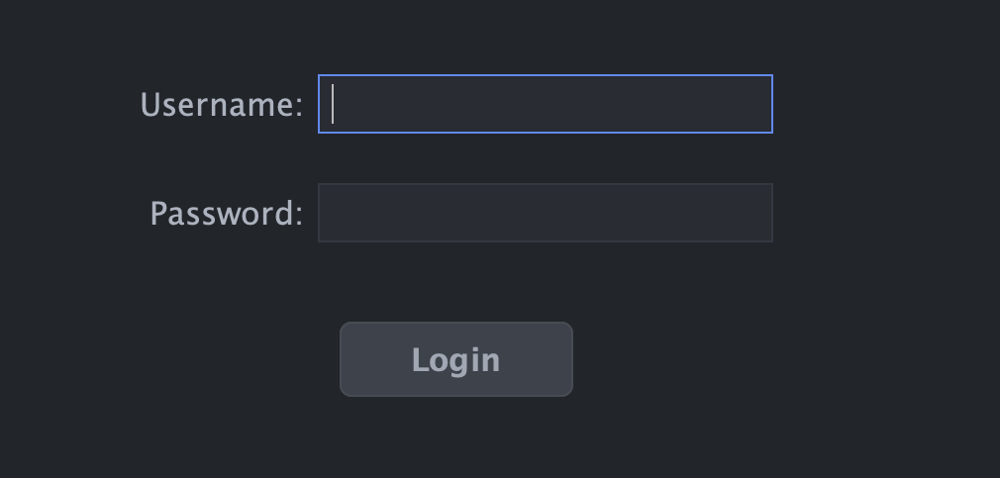
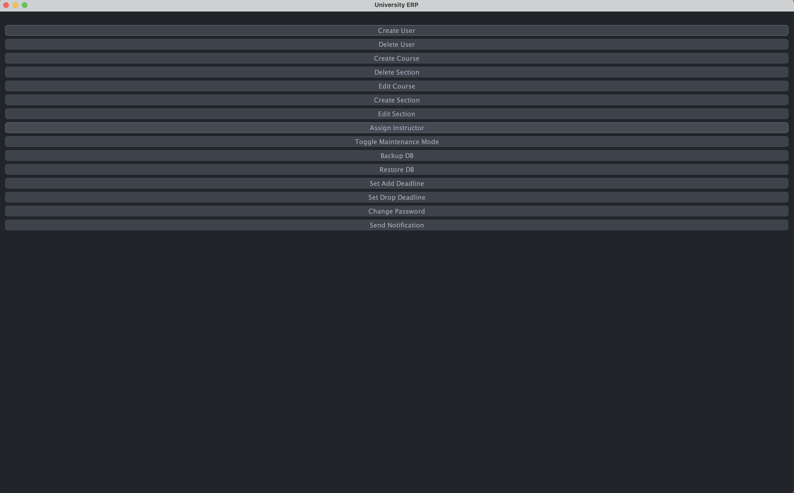
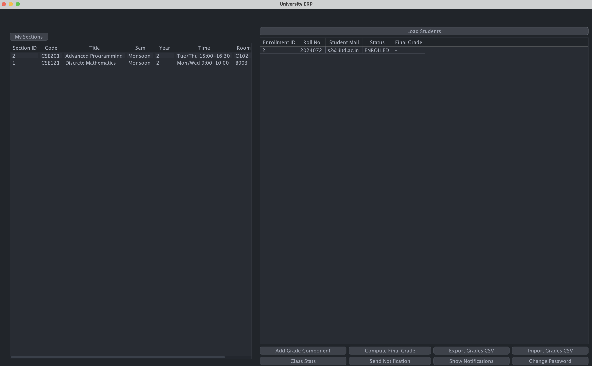
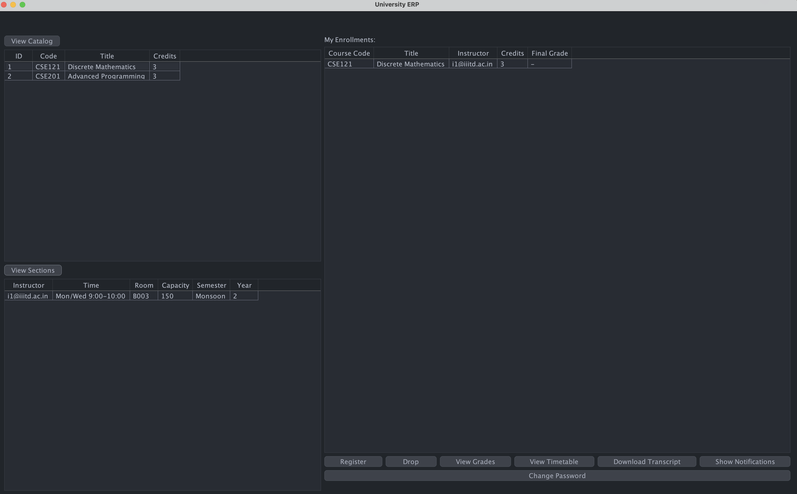
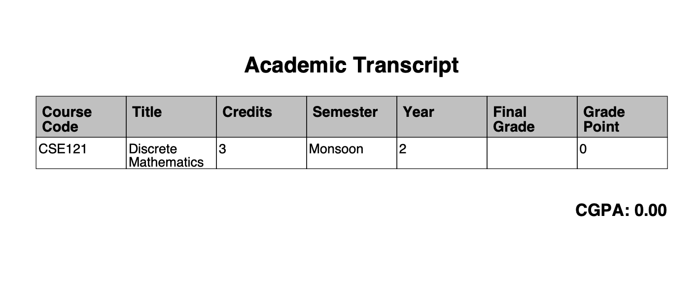
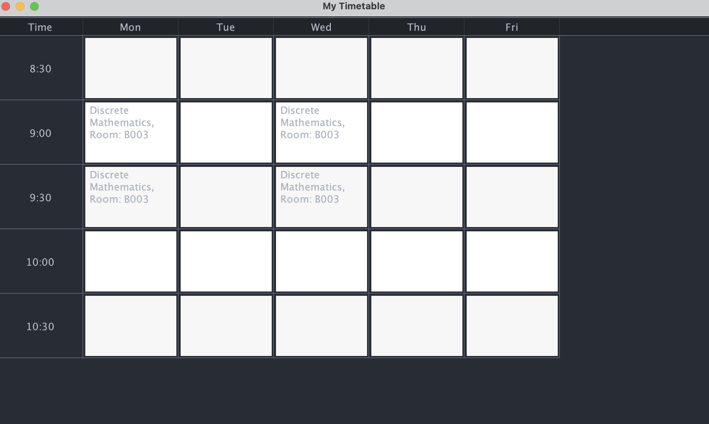

# erp-iiitd
An ERP that was made as a project in Advanced Programming Course (CSE201) at IIITD

# Team
- [Anika Goyal](https://github.com/AnikaGoyal02)
- [Darsh Bhilwara](https://github.com/DarshBhilwara)

# Prerequisites
- You should have docker and java installed on your system.

# Running Steps
```bash
docker compose up -d 
mvn clean package
java -jar target/university-erp-1.0-jar-with-dependencies.jar
```

# File Structure
```
.
├── docker-compose.yml
├── docker-init
│   ├── auth_schema.sql
│   ├── erp_schema.sql
│   └── seed_data.sql
├── logs
│   └── erp.log
├── objectives.pdf
├── pom.xml
├── README.md
└── src
    └── main
        ├── java
        │   └── edu
        │       └── univ
        │           └── erp
        │               ├── auth
        │               │   ├── AuthService.java
        │               │   ├── PasswordUtil.java
        │               │   └── SessionManager.java
        │               ├── data
        │               │   ├── AuthDao.java
        │               │   ├── BaseDao.java
        │               │   ├── CourseDao.java
        │               │   ├── DBPool.java
        │               │   ├── EnrollmentDao.java
        │               │   ├── GradeDao.java
        │               │   ├── InstructorDao.java
        │               │   ├── NotificationDao.java
        │               │   ├── SectionDao.java
        │               │   ├── SettingsDao.java
        │               │   └── StudentDao.java
        │               ├── domain
        │               │   ├── Admin.java
        │               │   ├── Course.java
        │               │   ├── Enrollment.java
        │               │   ├── grades
        │               │   │   ├── AssignmentComponent.java
        │               │   │   ├── EndsemComponent.java
        │               │   │   ├── Gradebook.java
        │               │   │   ├── GradeComponent.java
        │               │   │   ├── GradeType.java
        │               │   │   ├── MidsemComponent.java
        │               │   │   ├── ProjectComponent.java
        │               │   │   └── QuizComponent.java
        │               │   ├── Instructor.java
        │               │   ├── Notification.java
        │               │   ├── NotificationTarget.java
        │               │   ├── Role.java
        │               │   ├── Section.java
        │               │   ├── Student.java
        │               │   ├── TranscriptRow.java
        │               │   └── User.java
        │               ├── exception
        │               │   ├── AccessDeniedException.java
        │               │   ├── AuthException.java
        │               │   ├── DatabaseException.java
        │               │   ├── ERPException.java
        │               │   ├── NotFoundException.java
        │               │   └── ValidationException.java
        │               ├── service
        │               │   ├── AccessControl.java
        │               │   ├── AdminService.java
        │               │   ├── InstructorService.java
        │               │   ├── NotificationListener.java
        │               │   ├── NotificationService.java
        │               │   └── StudentService.java
        │               ├── ui
        │               │   ├── admin
        │               │   │   ├── AddCourseDialog.java
        │               │   │   ├── AddSectionDialog.java
        │               │   │   ├── AddUserDialog.java
        │               │   │   ├── AdminPanel.java
        │               │   │   └── AssignInstructorDialog.java
        │               │   ├── components
        │               │   │   ├── DeadlineRefresher.java
        │               │   │   ├── MaintenanceBanner.java
        │               │   │   ├── MaintenanceRefresher.java
        │               │   │   ├── NotificationBanner.java
        │               │   │   └── ToastBanner.java
        │               │   ├── DashboardFrame.java
        │               │   ├── grades
        │               │   │   └── GradeTableFrame.java
        │               │   ├── InstructorPanel.java
        │               │   ├── LoginFrame.java
        │               │   ├── Main.java
        │               │   ├── NotificationDialog.java
        │               │   ├── StudentPanel.java
        │               │   ├── timetable
        │               │   │   ├── TimeSlotParser.java
        │               │   │   ├── TimetableFrame.java
        │               │   │   └── TimetableModel.java
        │               │   ├── UIError.java
        │               │   └── UIStyle.java
        │               └── util
        │                   ├── AutoTableResize.java
        │                   └── export
        │                       └── CSVExporter.java
        └── resources
            ├── application.properties
            ├── fonts
            │   └── Cantarell-Regular.ttf
            └── logback.xml

25 directories, 85 files
```

---

# Directly interacting with the database
```bash
docker exec -it erp-mariadb mysql -u root -p
```

# 1. Introduction
This project implements a functional University ERP desktop application using Java Swing.  
The application supports three user roles—Student, Instructor, and Admin—and provides features such as section registration, class management, grade entry, viewing academic records, and transcript exports.

The system uses **two separate databases**:

1. **Auth DB** - stores usernames, roles, and bcrypt password hashes  
2. **ERP DB** - stores academic data: students, instructors, courses, sections, enrollments, grades, settings

A modular, layered architecture is followed: **UI -> API -> Service -> Data -> DB**, ensuring proper separation of concerns and maintainability.

---

## 2. System Architecture Overview

### 2.1 Layered Structure
- **UI Layer (Swing + FlatLaf)**  
  Contains all screen components, tables, dialogs, and user workflows.

- **API Layer**  
  A clean set of methods the UI calls (e.g., login, registerSection, enterGrade).

- **Service Layer**  
  Core business logic, such as access-checking, maintenance checks, validation, and rule enforcement.

- **Data Layer (JDBC + HikariCP)**  
  Database reading/writing, SQL execution, and connection pooling.

- **Auth Layer**  
  Handles login verification, bcrypt hashing, password change, and session storage.

- **Utility Layer**  
  PDF/CSV exports, message helpers, formatting helpers.

### 2.2 Technologies Used
- Java Swing  
- FlatLaf for Modern UI  (IntelliJ OneDark)
- MigLayout  
- JDBC + HikariCP  
- MySQL / MariaDB  
- jBCrypt (password hashing)  
- OpenCSV  
- PDFBox  
- JUnit 5  
- java.util.logging  

---

## 3. Database Structure

### 3.1 ERPDB
```
courses
+-------------+---------------------+------+-----+---------+----------------+
| Field       | Type                | Null | Key | Default | Extra          |
+-------------+---------------------+------+-----+---------+----------------+
| course_id   | int(10) unsigned    | NO   | PRI | NULL    | auto_increment |
| code        | varchar(10)         | NO   | UNI | NULL    |                |
| title       | varchar(150)        | NO   |     | NULL    |                |
| credits     | tinyint(3) unsigned | NO   |     | NULL    |                |
| description | text                | YES  |     | NULL    |                |
| is_active   | tinyint(1)          | YES  |     | 1       |                |
+-------------+---------------------+------+-----+---------+----------------+

enrollments
+---------------+----------------------------------------+------+-----+---------------------+----------------+
| Field         | Type                                   | Null | Key | Default             | Extra          |
+---------------+----------------------------------------+------+-----+---------------------+----------------+
| enrollment_id | int(10) unsigned                       | NO   | PRI | NULL                | auto_increment |
| student_id    | int(10) unsigned                       | NO   | MUL | NULL                |                |
| section_id    | int(10) unsigned                       | NO   | MUL | NULL                |                |
| status        | enum('ENROLLED','DROPPED','COMPLETED') | YES  |     | ENROLLED            |                |
| registered_on | datetime                               | YES  |     | current_timestamp() |                |
| dropped_on    | datetime                               | YES  |     | NULL                |                |
| final_grade   | varchar(4)                             | YES  |     | NULL                |                |
+---------------+----------------------------------------+------+-----+---------------------+----------------+

grades
+----------------+------------------+------+-----+---------------------+----------------+
| Field          | Type             | Null | Key | Default             | Extra          |
+----------------+------------------+------+-----+---------------------+----------------+
| grade_id       | int(10) unsigned | NO   | PRI | NULL                | auto_increment |
| enrollment_id  | int(10) unsigned | NO   | MUL | NULL                |                |
| component_type | varchar(50)      | NO   |     | NULL                |                |
| component_name | varchar(100)     | NO   |     | NULL                |                |
| score          | decimal(7,2)     | YES  |     | NULL                |                |
| max_score      | decimal(7,2)     | YES  |     | NULL                |                |
| weightage      | decimal(6,2)     | YES  |     | 0.00                |                |
| remarks        | varchar(255)     | YES  |     | NULL                |                |
| created_at     | datetime         | YES  |     | current_timestamp() |                |
+----------------+------------------+------+-----+---------------------+----------------+

instructors
+---------------+------------------+------+-----+---------------------+----------------+
| Field         | Type             | Null | Key | Default             | Extra          |
+---------------+------------------+------+-----+---------------------+----------------+
| instructor_id | int(10) unsigned | NO   | PRI | NULL                | auto_increment |
| user_id       | int(10) unsigned | NO   | UNI | NULL                |                |
| department    | varchar(100)     | NO   |     | NULL                |                |
| designation   | varchar(50)      | YES  |     | Assistant Professor |                |
| email         | varchar(100)     | YES  |     | NULL                |                |
| phone         | varchar(15)      | YES  |     | NULL                |                |
| office        | varchar(20)      | YES  |     | NULL                |                |
| joined_on     | date             | YES  |     | curdate()           |                |
+---------------+------------------+------+-----+---------------------+----------------+

notifications
+----------------+-----------------------------------------------------------------+------+-----+---------------------+----------------+
| Field          | Type                                                            | Null | Key | Default             | Extra          |
+----------------+-----------------------------------------------------------------+------+-----+---------------------+----------------+
| id             | int(10) unsigned                                                | NO   | PRI | NULL                | auto_increment |
| sender_user_id | int(10) unsigned                                                | NO   | MUL | NULL                |                |
| target_type    | enum('ALL','COURSE','SECTION','ALL_STUDENTS','ALL_INSTRUCTORS') | NO   |     | NULL                |                |
| target_id      | int(10) unsigned                                                | YES  |     | NULL                |                |
| title          | varchar(255)                                                    | NO   |     | NULL                |                |
| message        | text                                                            | NO   |     | NULL                |                |
| created_at     | timestamp                                                       | YES  |     | current_timestamp() |                |
+----------------+-----------------------------------------------------------------+------+-----+---------------------+----------------+

sections
+---------------+-----------------------------------+------+-----+---------------------+-------------------------------+
| Field         | Type                              | Null | Key | Default             | Extra                         |
+---------------+-----------------------------------+------+-----+---------------------+-------------------------------+
| section_id    | int(10) unsigned                  | NO   | PRI | NULL                | auto_increment                |
| course_id     | int(10) unsigned                  | NO   | MUL | NULL                |                               |
| instructor_id | int(10) unsigned                  | YES  | MUL | NULL                |                               |
| day_time      | varchar(50)                       | NO   |     | NULL                |                               |
| room          | varchar(20)                       | YES  |     | NULL                |                               |
| capacity      | smallint(5) unsigned              | NO   |     | NULL                |                               |
| semester      | enum('Summer','Winter','Monsoon') | NO   |     | NULL                |                               |
| year          | int(10) unsigned                  | NO   |     | NULL                |                               |
| created_at    | datetime                          | YES  |     | current_timestamp() |                               |
| updated_at    | datetime                          | YES  |     | current_timestamp() | on update current_timestamp() |
+---------------+-----------------------------------+------+-----+---------------------+-------------------------------+

settings
+------------+------------------+------+-----+---------------------+-------------------------------+
| Field      | Type             | Null | Key | Default             | Extra                         |
+------------+------------------+------+-----+---------------------+-------------------------------+
| key        | varchar(50)      | NO   | PRI | NULL                |                               |
| value      | varchar(100)     | YES  |     | NULL                |                               |
| updated_at | datetime         | YES  |     | current_timestamp() | on update current_timestamp() |
| updated_by | int(10) unsigned | YES  |     | NULL                |                               |
+------------+------------------+------+-----+---------------------+-------------------------------+

students
+-----------------+------------------+------+-----+-----------+----------------+
| Field           | Type             | Null | Key | Default   | Extra          |
+-----------------+------------------+------+-----+-----------+----------------+
| student_id      | int(10) unsigned | NO   | PRI | NULL      | auto_increment |
| user_id         | int(10) unsigned | NO   | UNI | NULL      |                |
| roll_no         | varchar(20)      | NO   | UNI | NULL      |                |
| program         | varchar(100)     | NO   |     | NULL      |                |
| year            | int(10) unsigned | NO   |     | NULL      |                |
| email           | varchar(100)     | YES  |     | NULL      |                |
| phone           | varchar(15)      | YES  |     | NULL      |                |
| join_date       | date             | YES  |     | curdate() |                |
| graduation_year | int(10) unsigned | YES  |     | NULL      |                |
+-----------------+------------------+------+-----+-----------+----------------+
```


### 3.2 AuthDB
```
users_auth
+-----------------+--------------------------------------+------+-----+---------------------+-------------------------------+
| Field           | Type                                 | Null | Key | Default             | Extra                         |
+-----------------+--------------------------------------+------+-----+---------------------+-------------------------------+
| user_id         | int(10) unsigned                     | NO   | PRI | NULL                | auto_increment                |
| username        | varchar(50)                          | NO   | UNI | NULL                |                               |
| role            | enum('ADMIN','INSTRUCTOR','STUDENT') | NO   |     | NULL                |                               |
| password_hash   | varchar(255)                         | NO   |     | NULL                |                               |
| status          | enum('ACTIVE','LOCKED','DISABLED')   | NO   |     | ACTIVE              |                               |
| failed_attempts | int(10) unsigned                     | NO   |     | 0                   |                               |
| locked_until    | bigint(20)                           | YES  |     | NULL                |                               |
| last_login      | datetime                             | YES  |     | NULL                |                               |
| created_at      | datetime                             | YES  |     | current_timestamp() |                               |
| updated_at      | datetime                             | YES  |     | current_timestamp() | on update current_timestamp() |
+-----------------+--------------------------------------+------+-----+---------------------+-------------------------------+
```

--- 

## 4. Key Features Implemented

### 4.1 Common Features
- Login with bcrypt password verification  
- Appropriate dashboards per role  
- Sortable, scrollable tables  
- Clear error/success messages  
- Automatic blocking under Maintenance Mode  

### 4.2 Student Features
- Browse courses and sections  
- Register for a section if allowed  
- Drop sections before deadline  
- View timetable  
- View grades (components + final grade)  
- Export transcript (CSV or PDF)

**Registration Validations:**
- Cannot register twice  
- Cannot register if capacity is full  
- Cannot register after deadline  
- Cannot register when Maintenance Mode is ON  

### 4.3 Instructor Features
- View only their assigned sections  
- Add assessment components  
- Enter student scores  
- Compute final grades using weight distribution  
- Export gradebook CSV  
- View basic statistics (average, min, max)

**Example final grade calculation:**
```
A+ : 95–100
A : 90–94.99
A- : 85–89.99
B : 75–84.99
B- : 65–74.99
C : 55–64.99
D : 45–54.99
F : <45
```


### 4.4 Admin Features
- Add users to Auth DB  
- Create ERP profiles (students/instructors)  
- Create and edit courses  
- Create and edit sections  
- Assign instructors to sections  
- Toggle Maintenance Mode

---

## 5. Access Rules Enforcement

| Role | Allowed Actions |
|------|-----------------|
| Admin | Full access to everything |
| Instructor | Only their sections & grades |
| Student | Only their own registrations & records |

Before any action, the Service Layer checks:

1. Is user allowed to perform this action?  
2. Is Maintenance Mode OFF?  
3. Is the action valid (capacity, duplicates, deadlines)?  
4. Does the record belong to the user (student/instructor)?  

If any check fails, a friendly error message is displayed.

---

## 6. Maintenance Mode

Stored in `settings` table as:
```bash
maintenance = true/false
```
When Maintenance Mode = **ON**:
- Students cannot register or drop sections  
- Instructors cannot enter or edit grades  
- Admin is unaffected  
- A red banner is shown on all restricted screens  
- All modifying API calls return: `“Maintenance Mode is ON. This action is temporarily disabled.”`

---

## 7. Workflow Descriptions

### 7.1 Student Section Registration Flow
1. Student opens course catalog  
2. Chooses a section  
3. UI calls API → service.register  
4. Service validates:  
   - Maintenance status  
   - Access rights  
   - Capacity > 0  
   - No duplicate  
5. Enrollment is created  
6. UI refreshes and shows updated timetable  

### 7.2 Instructor Grade Entry Flow
1. Instructor selects a section  
2. Views roster  
3. Adds assessment components  
4. Inputs scores  
5. Clicks “Calculate Final Grade”  
6. Grades stored to DB  

### 7.3 Admin Maintenance Mode Flow
1. Admin toggles maintenance  
2. DB saved to `settings`  
3. UI of other roles becomes read-only instantly  

---

## 8. Testing Summary

### 8.1 Acceptance Tests (All Passed)
- Wrong password correctly rejected  
- Role-specific dashboards shown  
- Student registration worked  
- Duplicate enrollment blocked  
- Full section blocked  
- Drop before deadline allowed  
- Grade entry for own sections allowed  
- Grade entry for others’ sections not possible 
- Admin course creation functional  
- Maintenance Mode blocks all student/instructor writes  
- Transcript export works  
- Password hash visible in Auth DB  
- ERP DB contains zero password fields  

### 8.2 Edge Case Tests
- Negative capacities blocked  
- Registration after deadline blocked  
- Unauthorized access attempts blocked  
- Section deletion with active enrollments restricted  
- Duplicate enrollments prevented  

### 8.3 Security Tests
- No plaintext passwords stored  
- bcrypt verification works  
- Only user_id + role stored in session  
- Failed login attempts handled gracefully  

---

## 9. Conclusion
The University ERP System meets all core functional, security, and architectural expectations:

- Secure authentication with bcrypt  
- Separation of Auth DB and ERP DB  
- Complete workflows for Student/Instructor/Admin  
- Proper access control  
- Maintenance Mode  
- CSV/PDF export functionality  
- Responsive and stable UI  

**Future enhancements:**
- Notification panel  
- Automated backups  
- Dark mode theme  
- Advanced analytics dashboards  
- Excel export support  

---

## Appendix - Screenshots
- Login

- Admin

- Instructor

- Student

- Transcript PDF

- TimeTable



# Closing Steps
```bash
docker compose down -v
mvn clean
```

